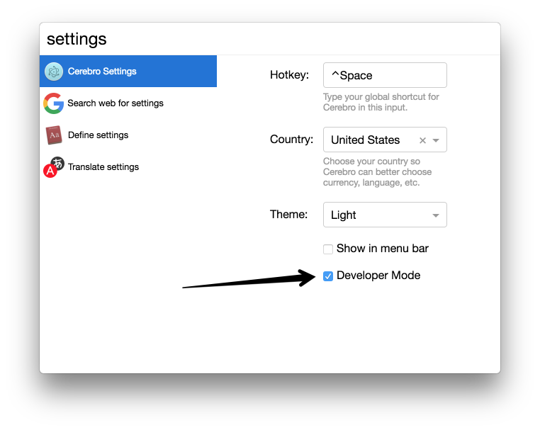

# Cerebro Plugin

> It is boilerplate to create plugins for [Cerebro app](http://www.cerebroapp.com)

## Usage
* Clone this repo to your machine;
* Edit `package.json` – `name`, `description`, `author` and `repository` fields;
* Run `npm install` – you are ready to build your plugin!

## Debugging your plugin
* Open [Cerebo app](http://www.cerebroapp.com);
* Enter `settings` and open preview for Cerebro Settings;
* Turn on developer mode;
* Restart Cerebro app.



Now you can open developer tools in Cerebro using <kbd>alt+cmd+i</kbd>. In developer tools you can use <kbd>cmd+r</kbd> to reload application to see changes in your plugin.

Put your plugin directory to `~/Library/Application\ Support/Cerebro/plugins/`. Easiest way to do it is to use symbolic links, i.e.
```
ln -s ~/projects/cerebro-emoj ~/Library/Application\ Support/Cerebro/plugins/cerebro-emoj
```

## Documentation
Use Cerebro [documentation](https://github.com/KELiON/cerebro/blob/master/docs/plugins.md) for plugins.

## Related

- [Cerebro](http://github.com/KELiON/cerebro) – main repo for Cerebro app;
- [cerebro-emoj](https://github.com/KELiON/cerebro-emoj) – example Cerebro plugin to look for emojis. Check this repo commit by commit to see how to create Cerebro plugins from scratch.

## License

MIT © [Alexandr Subbotin](http://asubbotin.ru)
